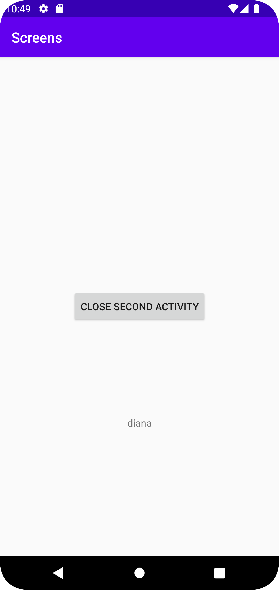

Rapport 4.

Jag har lagt till en second activity vilket gör det möjligt att gå från en sida till en annan genom en knapp som leder till second activity och en data string som följer med.

Hänvisar till kod nedanför, knapp med ID start_second_activity gör det möjligt att hämta aktivitetens layout fil med assisterande utav findviewbyId. SetOnClickListener gör det sedan möjligt att lyssna efter knapp som kan reagera på klickningar utav användare.
Secondactivity.class används för att klargöra vilken aktivitet som ska startas.
Extra data med namnet 'name' och värdet 'diana' läggs till Intent genom putExra(), vilket gör det möjligt för datan att hämtas av den nya aktiviteten.

```
   @Override
    protected void onCreate(Bundle savedInstanceState) {
        super.onCreate(savedInstanceState);
        setContentView(R.layout.activity_main);
        Button button = findViewById(R.id.start_second_activity);
        button.setOnClickListener(new View.OnClickListener() {
            @Override
            public void onClick(View view) {
                Intent intent = new Intent(MainActivity.this, SecondActivity.class);
                intent.putExtra( "name", "diana");
                startActivity(intent);
            }
        });
    }
```




